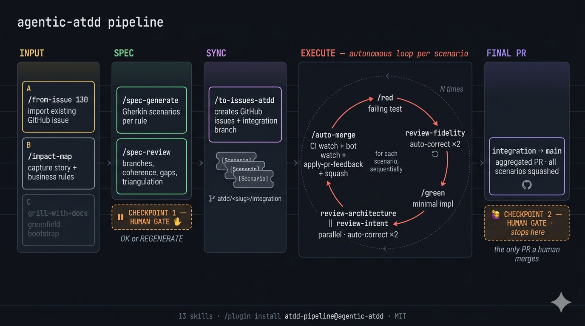

# agentic-atdd



ATDD pipeline for Claude Code and Codex. You start with a user story, you end with a PR sitting on `main` waiting for your review. Everything in between runs without you.

The skills are small. You can read any one of them in under a minute, fork it, swap it out. No monolith, no framework lock-in.

## What it does

You give the pipeline a story (or import a GitHub issue you already wrote). It:

1. Interviews you on the business rules until they're concrete enough to test.
2. Generates Gherkin scenarios tagged by test level (`@use-case`, `@e2e`, `@ui`) and by branch (`@nominal`, `@violation`, `@auth`, `@technical`, `@limit`).
3. Stops. You read the scenarios. You say `OK` or `REGENERATE <reason>`.
4. Pushes the spec to GitHub Issues — one parent, one user story, one sub-issue per scenario. Idempotent, so you can rerun without duplicates.
5. Creates an integration branch (`atdd/<slug>/integration`) off `main`.
6. For each scenario sub-issue: writes the failing test, runs `review-fidelity`, auto-corrects up to twice, then writes the minimal implementation, runs `review-architecture` and `review-intent` in parallel, auto-corrects up to twice, opens a draft PR targeting the integration branch.
7. Marks the PR ready, watches CI, watches bot reviewers (CodeRabbit, codex, github-actions, whatever you've wired). When the bots go quiet, if there's actionable feedback it invokes `apply-pr-feedback`, pushes, and loops. When CI is green and nothing is outstanding, it squash-merges into the integration branch.
8. Repeats for every scenario.
9. Opens one final PR `integration → main` and stops there. That PR is yours to merge.

Two human gates: the spec, and the final PR. The rest is hands-off.

## Install

### Claude Code (recommended)

```
/plugin marketplace add mpiton/agentic-atdd
/plugin install atdd-pipeline@agentic-atdd
```

The plugin's skills and slash commands get namespaced under `atdd-pipeline:*`. No clone, no symlink, no shell script. Updates flow through `/plugin update`.

### Manual install (Codex CLI, or Claude Code without the marketplace)

```bash
git clone https://github.com/mpiton/agentic-atdd ~/.claude/plugins/atdd-pipeline
~/.claude/plugins/atdd-pipeline/scripts/install.sh
```

The script symlinks every skill folder into `~/.claude/skills/` and (when present) `~/.codex/skills/`. Same `SKILL.md` files on both harnesses, single source of truth. Restart the CLI to refresh the skill index.

Per-repo setup is a one-time interview:

```bash
/setup-atdd-pipeline
```

Writes `.atdd-pipeline.json` at the repo root. Auto-merge is on by default, the idle window for bot review is 5 minutes, apply-pr-feedback is capped at 3 iterations. Tunable.

## Skills

### Spec phase

- [`impact-map`](skills/spec/impact-map/SKILL.md) — capture a story, an actor, a goal, business rules numbered `R-NN`.
- [`from-issue`](skills/spec/from-issue/SKILL.md) — import an existing GitHub issue. The issue you already wrote stays; the pipeline back-fills `context.md` from its body.
- [`spec-generate`](skills/spec/spec-generate/SKILL.md) — Gherkin scenarios from the context, one feature file per rule.
- [`spec-review`](skills/spec/spec-review/SKILL.md) — read-only audit of the scenarios across four axes (branches, coherence, gaps, triangulation).

### Sync phase

- [`to-issues-atdd`](skills/sync/to-issues-atdd/SKILL.md) — idempotent `gh` CLI sync of the scenario hierarchy. Also provisions the integration branch.

### Execute phase

- [`red-cycle`](skills/execute/red-cycle/SKILL.md) — generate the failing test, run `review-fidelity`, auto-correct ×2 then escalate.
- [`green-cycle`](skills/execute/green-cycle/SKILL.md) — minimal implementation, `review-architecture` and `review-intent` in parallel, auto-correct ×2 then escalate. Opens the draft PR against the integration branch.
- [`review-fidelity`](skills/execute/review-fidelity/SKILL.md) — does the test mirror the Gherkin? Structure, semantics, intent.
- [`review-architecture`](skills/execute/review-architecture/SKILL.md) — placement, naming, conventions, domain responsibilities.
- [`review-intent`](skills/execute/review-intent/SKILL.md) — does the code do only what the test asks? No hidden side effects, no speculative branches.
- [`apply-pr-feedback`](skills/execute/apply-pr-feedback/SKILL.md) — fetch every actionable review comment (bot or human) on a PR, apply only the changes asked for, commit and push. Bundled so the plugin has no external skill dependency.
- [`pr-auto-merge`](skills/execute/pr-auto-merge/SKILL.md) — watches CI plus bot reviewers, runs `apply-pr-feedback` on actionable feedback, squash-merges into the integration branch. Refuses to operate on PRs whose base is `main` (the final PR is always your call).

### Orchestrator

- [`atdd-run`](skills/orchestrate/atdd-run/SKILL.md) — end-to-end driver. Chains every phase, stops at the two human gates.
- [`setup-atdd-pipeline`](skills/orchestrate/setup-atdd-pipeline/SKILL.md) — per-repo configuration.

## Slash commands

| Command | What it does |
|---|---|
| `/setup-atdd-pipeline` | One-time per-repo config. |
| `/impact-map` | Capture a new story. |
| `/from-issue <N>` | Import an existing GitHub issue. |
| `/spec-generate` | Gherkin scenarios from the context. |
| `/spec-review` | Read-only review of the scenarios. |
| `/to-issues-atdd` | Sync to GitHub Issues + create the integration branch. |
| `/red <issue>` | Failing test for one scenario. |
| `/green <issue>` | Minimal implementation + open the draft PR. |
| `/auto-merge <pr>` | Watch + apply-pr-feedback + squash-merge a sub-PR. |
| `/apply-pr-feedback [pr]` | Apply every actionable review comment on a PR, commit, push. |
| `/atdd-run <us-slug>` | Run the whole thing end to end. |
| `/review-fidelity` · `/review-architecture` · `/review-intent` | Standalone reviewer runs. |

## How to use it

Read [`docs/USAGE.md`](docs/USAGE.md) for the three entry paths (existing GitHub issue, fresh feature with a PRD already in hand, greenfield with nothing). The visual version of the same three paths lives at [`docs/workflows.html`](docs/workflows.html) — open it in a browser.

## Codex portability

Codex CLI auto-discovers skills from `~/.codex/skills/<name>/SKILL.md` using the same format Claude Code uses. The installer symlinks each plugin skill into both `~/.claude/skills/` and `~/.codex/skills/`, so one edit propagates to both harnesses. `scripts/sync-codex.sh` is a deprecated alias that delegates to `install.sh`.

Parallel reviewers (the default on Claude Code via the `Task` tool) fall back to sequential execution under Codex automatically. You can force sequential anywhere with `--sequential` on `atdd-run`.

## Example

[`examples/cart-checkout/`](examples/cart-checkout/) is a full worked artifact set: `context.md`, two `.feature` files, a `review.md` carrying a `REGENERATE` verdict, and the `issues.json` you get after sync. Good place to look at what the pipeline produces before you run it on something real.

## Reviewer fixtures

[`tests/fixtures/`](tests/fixtures/) holds pass/fail golden cases for each reviewer skill. Edit a reviewer prompt, replay the fixtures, catch regressions. See [`tests/README.md`](tests/README.md) for the contract.

## Design principles

1. **Small composable skills.** You should be able to delete any one of them and replace it with your own version in an afternoon.
2. **Two hard human gates.** Post-spec and the final PR. Nothing else asks for your input.
3. **Bounded auto-correction.** Reviewer loops cap at 2 retries. The auto-merge apply-pr-feedback loop caps at 3. Past the cap, the pipeline drops an escalation comment on the issue or PR and moves on.
4. **Integration branch is mandatory.** Sub-PRs target `atdd/<slug>/integration`, never `main`. `pr-auto-merge` refuses to merge PRs whose base is the trunk.
5. **GitHub Issues is the database.** The spec, the work breakdown, the escalations — all of it lives there. The pipeline reads its own state from `gh` rather than from a sidecar file.

## License

MIT. See [`LICENSE`](LICENSE).

## Inspiration

The pipeline structure follows the multi-agent ATDD pattern: impact mapping, then Gherkin scenarios per business rule, then issues, then a RED/GREEN cycle with parallel reviewers. The skill-shape philosophy (small, hackable, no monolith) comes from [mattpocock/skills](https://github.com/mattpocock/skills). Several skills compose well with mattpocock's `grill-with-docs`, `to-prd`, and `improve-codebase-architecture`.
